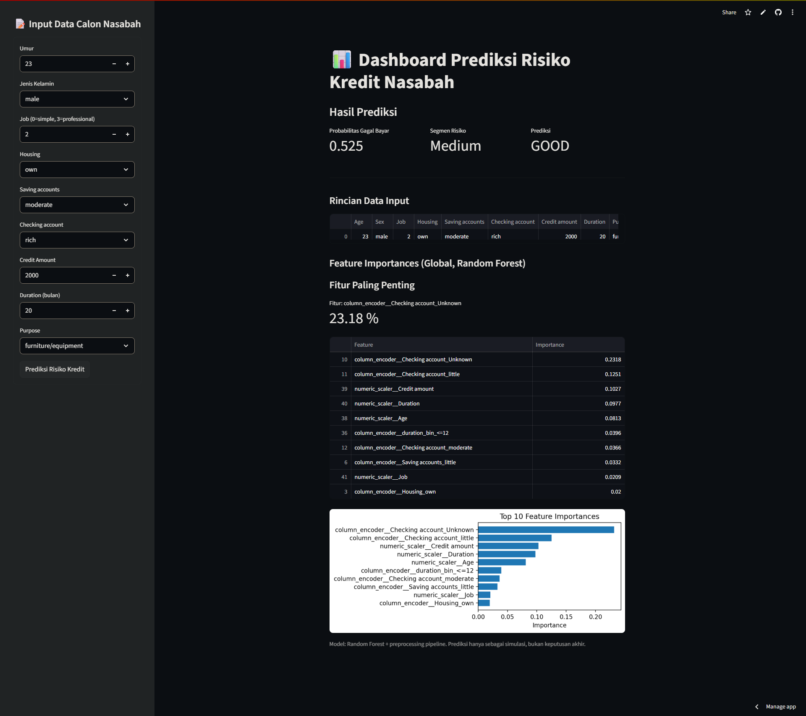

# Loan Default Risk Prediction & Profiling

**Memprediksi risiko gagal bayar nasabah kredit untuk mendukung keputusan underwriting dan manajemen risiko pada industri fintech dan perbankan.**

---

## Executive Summary

Model machine learning ini dikembangkan untuk memprediksi kemungkinan gagal bayar seorang nasabah berdasarkan data profil dan perilaku finansialnya.
Insight model membantu tim underwriting untuk mengidentifikasi nasabah berisiko tinggi secara **lebih akurat**, sehingga dapat mengurangi potensi kerugian dan meningkatkan efisiensi proses persetujuan kredit.

---

## Business Problem

- **Latar belakang:** Kredit macet adalah masalah utama di industri keuangan. Deteksi dini nasabah berisiko akan meningkatkan profitabilitas dan mengurangi NPL (Non-Performing Loan).
- **Goal:**

  - _Binary classification_: Memprediksi apakah nasabah termasuk kategori **"good"** (tidak gagal bayar) atau **"bad"** (berpotensi gagal bayar).
  - _Use-case_: Mendukung proses approval, risk-based pricing, dan mitigasi dengan lebih targeted.

## Dashboard Prediksi

### Cek live dashboard prediksi di sini:

[🔗 https://credit-data-sanz.streamlit.app/](https://credit-data-sanz.streamlit.app/)

#### **Instruksi Penggunaan**

1. **Input Data Nasabah:**

   - Masukkan data calon nasabah secara manual pada sidebar (Umur, Jenis Kelamin, Jumlah Kredit, dsb).

2. **Klik Prediksi:**

   - Setelah semua data diisi, klik tombol **Prediksi Risiko Kredit**.

3. **Hasil Prediksi:**

   - Dashboard akan menampilkan:

     - Probabilitas gagal bayar (score ML)
     - Segmen risiko (Low/Medium/High)
     - Prediksi (Good/Bad)
     - Rincian input
     - Fitur paling penting (feature importance)



## Dataset

- **Sumber:** https://www.kaggle.com/datasets/kabure/german-credit-data-with-risk
- **Jumlah data:** 1000 nasabah, 12 fitur demografik & finansial (umur, status tabungan, checking account, jumlah pinjaman, durasi, dll).
- **Fitur penting:**

  - `Checking account`, `Credit amount`, `Duration`, `Age`, `Saving accounts`, dll.

- **Distribusi label:** \~30% default (imbalanced data, sudah ditangani).

---

## Approach & Pipeline

1. **EDA & Data Cleaning**

   - Deteksi dan penanganan missing values, encoding variabel kategorik, scaling numerik, outlier, dan imbalanced data (undersampling).

2. **Feature Engineering**

   - Binning umur, credit amount, duration;

3. **Modeling**

   - Baseline: Logistic Regression & Random Forest (class_weight & pipeline).
   - Hyperparameter tuning dengan Optuna (industry standard).
   - Threshold tuning untuk F1-Score optimal.

4. **Model Interpretation**

   - Feature importance & SHAP untuk explainability.
   - Analisis individu (waterfall plot) dan segmentasi risiko.

5. **Insight Bisnis**

   - Segmentasi: Low, Medium, High Risk.
   - Rekomendasi kebijakan approval & mitigasi risiko.

6. **Evaluasi**

   - Cross-validation (F1, ROC-AUC).
   - Analisis error: False Positive/Negative & implikasinya.

---

## Hasil Utama

- **Model terbaik:** Random Forest (tuned)
- **F1-score (test set):** 0.662 (threshold optimal 0.54)
- **Top 3 fitur terpenting:**

  1. `Checking account` (khususnya Unknown & little)
  2. `Credit amount`
  3. `Duration`

- **Insight bisnis:**

  - Nasabah tanpa rekening giro/little → **risk tinggi**
  - Pinjaman besar & durasi panjang → **perlu jaminan tambahan**
  - Saving account “little” juga perlu perhatian ekstra

- **Segmentasi risiko:**

  - High Risk: 18%
  - Medium: 52%
  - Low: 30%
  - **False Negative** terkonsentrasi di Low Risk, bisa jadi prioritas review manual

---

## Business Recommendations

- Nasabah **high risk**: Review manual & persyaratan jaminan ketat.
- Nasabah **medium risk**: Approval bersyarat (misal, limit lebih kecil).
- Nasabah **low risk**: Bisa diproses otomatis dengan threshold tertentu.
- Perhatikan kelompok yang sering _miss-predicted_ (untuk mitigasi error).
- Model dipakai sebagai **decision support**, bukan pengganti manusia sepenuhnya.

---

## Model Explainability

- **Feature Importance:**

  

- **SHAP Summary & Waterfall Plot:**
  
  

---

## How to Run

1. **Clone repo:**
2. **Install requirements:**

   ```bash
   pip install -r requirements.txt
   ```

3. **Run notebook urut:**

   - `01_data_cleaning_eda.ipynb`
   - `02_feature_engineering_modelling.ipynb`
   - `03_model_interpretation_insight.ipynb`

---

## Limitasi Model

- Dataset kecil & tidak ada fitur waktu (histori pembayaran).
- Tidak ada data eksternal (income, credit bureau, dsb).
- Potensi bias (umur, tabungan rendah).
- Model hanya untuk **decision support** — hasil tetap perlu review manusia.

---

## Contact

> **Made by \[Sanjukin Pinem]**
> LinkedIn: \[[Linkedin](https://www.linkedin.com/in/sanjukin-pinem-55bb45330/)]
> Email: \[sanju329121@gmail.com]

---
